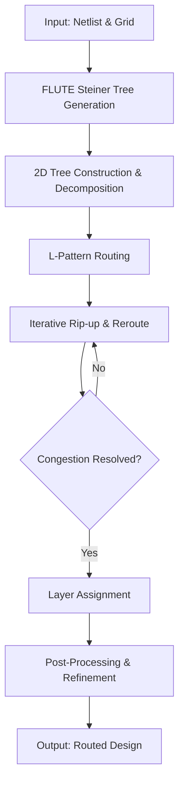
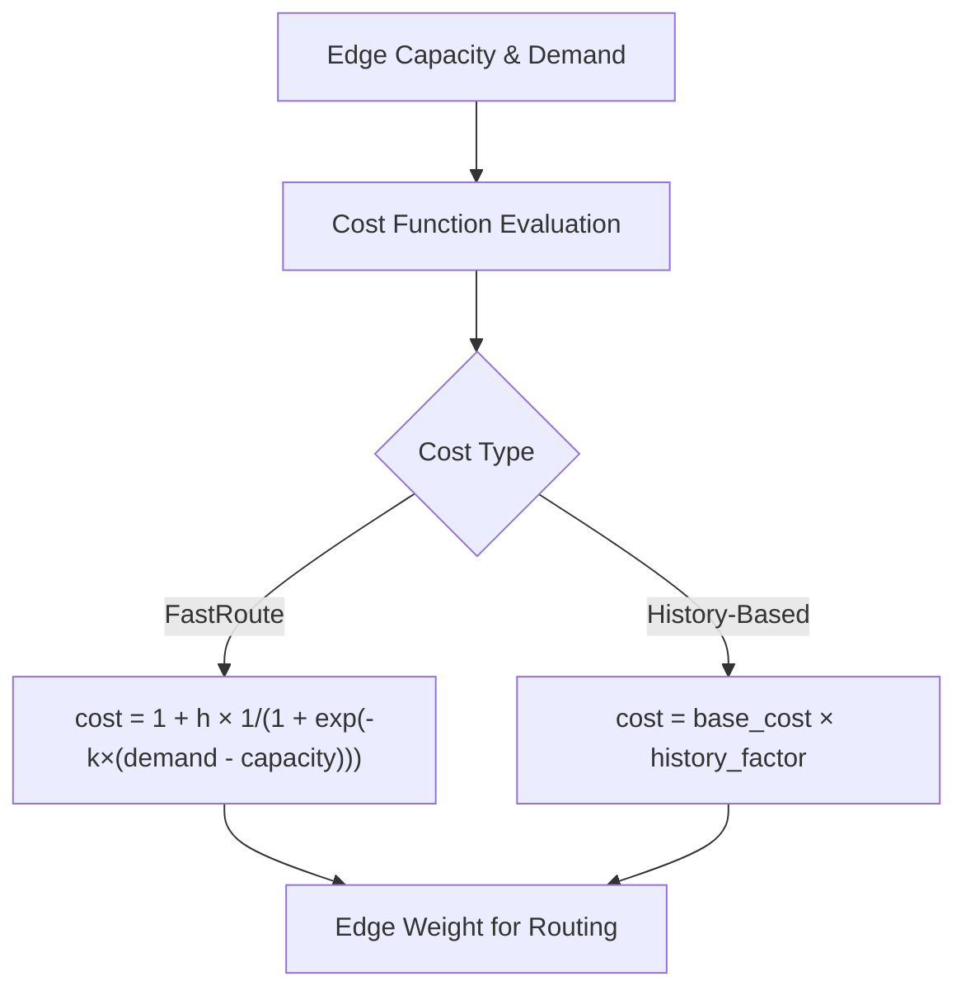
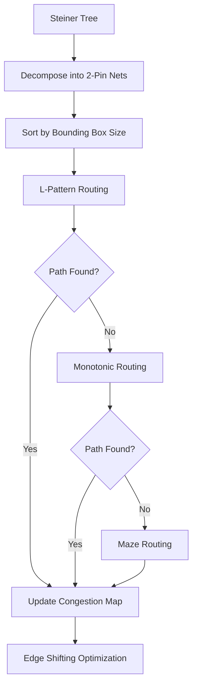
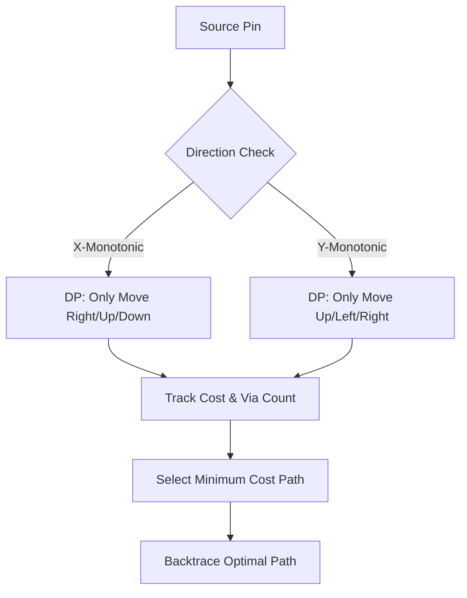
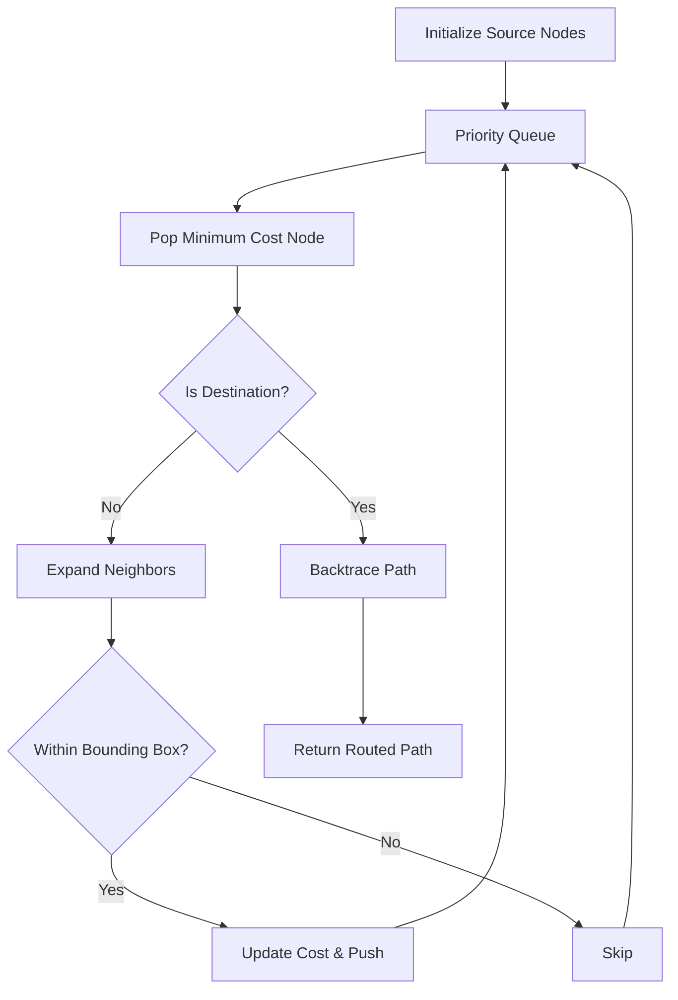
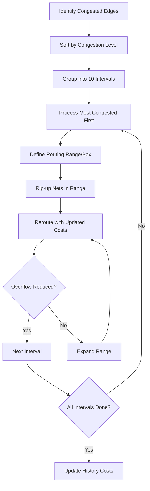
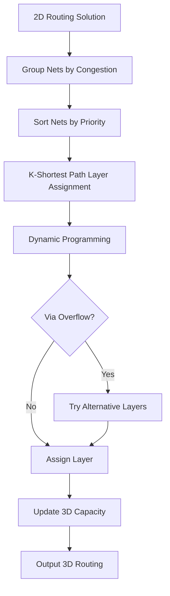

# NTHU-Route Algorithm Documentation

This document describes the primary algorithms used in the NTHU-Route global router for VLSI design. NTHU-Route 2.0 won 1st place at the ISPD 2008 Global Routing Contest.

## Overall Routing Pipeline

The routing process follows a multi-stage pipeline:

## 1. FLUTE Steiner Tree Generation

The [FLUTE](http://home.eng.iastate.edu/~cnchu/) library generates rectilinear Steiner minimum trees (RSMTs) for each net. FLUTE uses precomputed lookup tables (`POWV9.dat`, `POST9.dat`) to efficiently construct near-optimal Steiner trees.

**Purpose:** Provide an initial routing topology that minimizes total wirelength.

## 2. Congestion-Aware Cost Function

NTHU-Route uses a history-based cost function to evaluate edge congestion. The cost function guides routing decisions away from congested areas.

The sigmoid-based cost function increases sharply as edge demand approaches capacity, steering routes toward less congested edges.

## 3. 2D Tree Construction

This stage decomposes Steiner trees into 2-pin connections and routes them using multiple strategies:

### L-Pattern Routing

For each 2-pin net, the algorithm tries L-shaped paths (one bend) connecting the two pins. It evaluates both possible L-shapes and selects the one with lower congestion cost.

### Edge Shifting

After initial routing, edge shifting optimizes the Steiner tree by adjusting Steiner point positions to reduce overall congestion.

## 4. Monotonic Routing

Monotonic routing finds paths that are monotonic in at least one dimension (x or y). It uses dynamic programming to evaluate paths that only move in increasing coordinate directions.

**Advantages:** Efficient for non-congested regions; avoids detours.

## 5. Multi-Source Multi-Sink Maze Routing

When monotonic routing fails, the maze router finds paths using a Dijkstra-like algorithm with a priority queue (pairing heap).

The bounding box is adaptively expanded if no path is found within the initial box. This balances between routing quality and runtime.

## 6. Range Router (Rip-up & Reroute)

The range router handles congestion by iteratively ripping up and rerouting nets in congested regions:

## 7. Layer Assignment

After 2D routing, the layer assignment stage maps routes to specific metal layers in the 3D routing grid:

The layer assignment uses a BFS-based approach to find optimal layer combinations that minimize via count while respecting per-layer capacity constraints.

## 8. Post-Processing

The post-processing stage performs final refinement:

1. **Overflow Reduction:** Re-routes nets that contribute to remaining overflow.
2. **Wirelength Optimization:** Adjusts paths to minimize total wirelength without increasing congestion.
3. **Via Minimization:** Reduces unnecessary layer transitions.

## References

- Yen-Jung Chang, Yu-Ting Lee, and Ting-Chi Wang, "NTHU-Route 2.0: A Fast and Stable Global Router," ICCAD 2008.
- Jhih-Rong Gao, Pei-Ci Wu, and Ting-Chi Wang, "A New Global Router for Modern Designs," ASP-DAC 2008.
- Tsung-Hsien Lee and Ting-Chi Wang, "Congestion-Constrained Layer Assignment for Via Minimization in Global Routing," IEEE Transactions on Computer-Aided Design of Integrated Circuits and Systems, 2008.
- T.-H. Lee and T.-C. Wang, "Robust Layer Assignment for Via Optimization in Multi-layer Global Routing," ISPD 2009.
